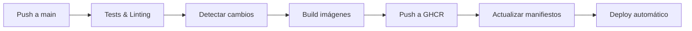

# 🎯 Frontend

> Plataforma de Machine Learning con interfaz web unificada para gestión de workflows y visualización de datos

[](https://python.org)
[](https://docker.com)
[](https://flask.palletsprojects.com/)

## 🚀 ¿Qué hace el proyecto?

Es una aplicación web que proporciona una interfaz unificada para acceder a herramientas de Machine Learning y análisis de datos. Actualmente integra:

- **Apache Airflow**: Orquestación de workflows y pipelines de ML
- **Panel Dashboard**: Visualizaciones interactivas y análisis de datos en tiempo real

### Modos de operación

El sistema puede funcionar en dos modos:

1. **Modo Desarrollo** (`static-web`): Acceso directo sin autenticación

## ✨ Características principales

- 🎨 **Interfaz moderna** con diseño responsivo
- 🐳 **Containerizado** con Docker
- 🔄 **CI/CD automatizado** con GitHub Actions
- 📊 **Dashboards interactivos** con Panel y Plotly
- 🌐 **Microservicios** independientes y escalables

## 📁 Estructura del proyecto

```
.
├── .github/workflows/
│   └── dashboard-ci.yml          # Pipeline CI/CD automatizado
├── static-web/                   # Servicio web estático
│   ├── templates/
│   │   ├── index.html           # Página principal
│   │   └── access_denied.html   # Página de acceso denegado
│   ├── app.py                   # Aplicación Flask
│   ├── Dockerfile               # Imagen Docker para static-web
│   └── requirements.txt         # Dependencias Python
├── visualization/               # Servicio de visualización
│   ├── app.py                  # Dashboard interactivo con Panel
│   ├── Dockerfile              # Imagen Docker para visualization
│   ├── requirements.txt        # Dependencias Python
│   └── probandopipe.txt        # Archivo de test para pipeline
├── app.py                      # Aplicación principal
├── docker-compose.yml          # Configuración para desarrollo local
└── .gitignore                  # Archivos ignorados por Git
```

## 📦 Dependencias

### Dependencias principales

**Servicio Static-Web:**
- `flask==2.3.3` - Framework web ligero

**Servicio Visualization:**
- `panel` - Framework para dashboards interactivos
- `plotly` - Visualizaciones interactivas
- `matplotlib` - Gráficos estáticos
- `seaborn` - Visualizaciones estadísticas
- `pandas` - Manipulación de datos
- `gunicorn` - Servidor WSGI para producción

**Aplicación Principal (con autenticación):**
- `flask` - Framework web
- `pyjwt` - Manejo de tokens JWT

### Dependencias del sistema

- **Docker** >= 20.10
- **Docker Compose** >= 2.0
- **Python** >= 3.9
- **Git** para control de versiones

## ⚙️ Configuración

### Variables de entorno

**Para el servicio static-web:**

```bash
# URLs de las aplicaciones (opcional, tiene valores por defecto)
AIRFLOW_URL=http://localhost:8080
PANEL_URL=http://localhost:5000
```

**Para la aplicación con autenticación:**

```bash
# URLs del frontend
FRONTEND_URL=http://localhost:3000
```

### Configuración de desarrollo

1. **Clonar el repositorio:**
   ```bash
   git clone <repository-url>
   cd egi-frontend
   ```

2. **Configurar variables de entorno:**
   ```bash
   # Crear archivo .env (opcional)
   cp .env.example .env
   # Editar .env con tus configuraciones
   ```

## 🔧 Cómo usar

### Desarrollo local con Docker Compose

```bash
# Levantar los servicios
docker-compose up -d

# Ver logs
docker-compose logs -f

# Parar los servicios
docker-compose down
```

**Acceso a los servicios:**
- Frontend (static-web): http://localhost:3000
- Panel Dashboard: http://localhost:5000

### Ejecución individual

**Servicio Static-Web:**
```bash
cd static-web
pip install -r requirements.txt
python app.py
```

**Servicio Visualization:**
```bash
cd visualization
pip install -r requirements.txt
panel serve app.py --address 0.0.0.0 --port 5000 --allow-websocket-origin=*
```

### Endpoints disponibles

**Static-Web Service:**
- `GET /` - Página principal
- `GET /airflow` - Redirige a Airflow
- `GET /panel` - Redirige a Panel
- `GET /health` - Health check
- `GET /info` - Información del sistema

**Visualization Service:**
- Panel dashboard con filtros interactivos
- Visualizaciones de correlación
- Gráficos por categorías

## 🚀 Despliegue

### Despliegue con Docker

**Construir las imágenes:**
```bash
# Imagen static-web
docker build -t egi-static-web:latest ./static-web

# Imagen visualization
docker build -t egi-visualization:latest ./visualization
```

**Ejecutar en producción:**
```bash
# Static-web
docker run -d -p 3000:3000 \
  -e AIRFLOW_URL=http://airflow:8080 \
  -e PANEL_URL=http://panel:5000 \
  egi-static-web:latest

# Visualization
docker run -d -p 5000:5000 \
  -v /path/to/data:/data \
  egi-visualization:latest
```

### Despliegue en Kubernetes

El proyecto utiliza GitOps con un repositorio separado de infraestructura:
- Repositorio de infraestructura: `Ml-For-Academic-Data/egi-infrastructure-k8s`
- Los manifiestos se actualizan automáticamente via CI/CD

**Archivos de configuración típicos:**
```yaml
# values-desarrollo.yaml
services:
  visualization:
    image:
      tag: "abc123"
  static-web:
    image:
      tag: "def456"
```

## 🔄 CI/CD

### Pipeline automatizado

El pipeline de GitHub Actions (`.github/workflows/dashboard-ci.yml`) incluye:

1. **Tests y Linting**
   - Ejecuta `flake8` para linting
   - Ejecuta `pytest` para unit tests

2. **Detección de cambios**
   - Detecta cambios en `visualization/` y `static-web/`
   - Solo construye servicios modificados

3. **Build y Push de imágenes**
   - Construye imágenes Docker automáticamente
   - Publica en GitHub Container Registry (GHCR)
   - Tags basados en SHA del commit

4. **Actualización de manifiestos**
   - Actualiza automáticamente los valores en el repo de infraestructura
   - Usa `yq` para modificar archivos YAML preservando estructura

### Configuración de secrets

**GitHub Secrets requeridos:**
```
REPO_ACCESS_TOKEN=<token-para-repo-infraestructura>
```

### Flujo de trabajo



## 🛠️ Desarrollo

### Estructura de código

**Principios de arquitectura:**
- **Microservicios**: Cada servicio es independiente
- **Separación de responsabilidades**: UI, autenticación y visualización separados
- **Containerización**: Cada servicio tiene su propio Dockerfile
- **Configuración externa**: Variables de entorno para configuración

### Agregar nuevos servicios

1. **Crear directorio del servicio:**
   ```bash
   mkdir nuevo-servicio
   cd nuevo-servicio
   ```

2. **Crear Dockerfile y requirements.txt**

3. **Actualizar docker-compose.yml**

4. **Modificar el pipeline CI/CD:**
   - Agregar detección de cambios
   - Agregar job de build
   - Actualizar step de manifiestos

### Testing

```bash
# Ejecutar tests
pip install flake8 pytest
flake8 . --count --select=E9,F63,F7,F82 --show-source --statistics
pytest

# Tests con coverage
pip install pytest-cov
pytest --cov=.
```

### Debugging

**Logs de contenedores:**
```bash
docker-compose logs -f <service-name>
```

**Conectarse a contenedor:**
```bash
docker-compose exec <service-name> bash
```

## 🤝 Contribución

### Proceso de contribución

1. **Fork del repositorio**
2. **Crear branch feature:**
   ```bash
   git checkout -b feature/nueva-funcionalidad
   ```
3. **Realizar cambios y commits**
4. **Ejecutar tests localmente**
5. **Crear Pull Request**

**Desarrollado por el equipo Byte Builders** 🚀
